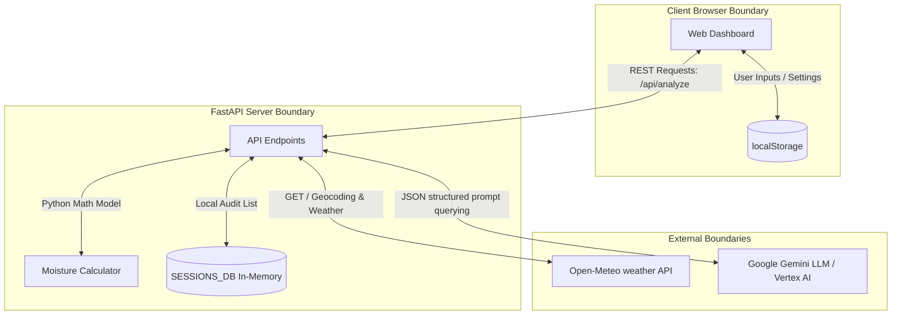

# STRIDE Threat Modeling Assessment: FloraWave Project

This document provides a systematic STRIDE threat modeling assessment of the **FloraWave** codebase and architecture. It maps the system boundaries, evaluates potential threat vectors across the six STRIDE pillars, and proposes mitigation strategies.

---

## 1. System Architecture & Boundaries

The following diagram illustrates the boundaries and data flows of the FloraWave system:

### Entry Points
- **REST Endpoints**:
  - `/api/analyze` (GET in presentation; POST in dev)
  - `/api/weather/{location_name}` (GET)
  - `/api/sessions` (GET)
- **User Inputs**: Balcony settings (City, Country, Zip, Covered status) and Plant configurations (Name, Species, Last Watered date, Sun hours, Rain exposure).

### Data Storage Layers
- **Client-side**: Browser `localStorage` (persists plant configurations and balcony settings).
- **Server-side**: In-memory list `SESSIONS_DB` (persists recent analysis session records in-memory during server runtime).
- **Static files**: `plant_database.json` (category thresholds, baseline depletion rates).

---

## 2. STRIDE Threat Analysis

The table below summarizes the threat vectors identified for each of the STRIDE pillars:

| Pillar | Threat Description | Severity | Target | Mitigation Strategy |
| :--- | :--- | :---: | :--- | :--- |
| **S**poofing | Unauthorized client requests to endpoints due to lack of authentication. | **Medium** | API Endpoints | Implement API key authorization or JWT user authentication. |
| **T**ampering | User manipulation of request payloads or tampering with browser `localStorage`. | **Low** | Local State / Input parameters | Add input validation & sanitization for text inputs (e.g. City/Country) to prevent injection risks. |
| **R**epudiation | Lack of persistent, secure, and signed audit trails for configuration changes. | **Low** | `SESSIONS_DB` | Persist audit logs to a secure, write-only database or logger with timestamps. |
| **I**nformation Disclosure | Potential leakage of internal environment details or API keys via stack traces or source repository. | **Medium** | Server / Repository | Standardize HTTP error responses (suppress internal stack traces) and enforce pre-commit checks (`safe_commit.py`). |
| **D**enial of Service | Rate-limit exhaustion on Open-Meteo or expensive LLM query quota exhaustion. | **High** | External APIs / LLM | Implement server-side caching of weather responses and rate-limiting per client IP. |
| **E**levation of Privilege | Lack of role-based access control, allowing any visitor to modify balcony config or reset inventory. | **Medium** | UI Settings | Restrict administrative actions (e.g., config changes/resets) to authenticated users. |

---

## 3. Pillar-by-Pillar Deep Dive

### 👤 Spoofing (Identity Spoofing)
- **Vulnerability**:
  - The application lacks any user authentication. Any client with network access to the port (`8000` or `8001`) can make requests to `/api/analyze`.
  - The integration with Google Cloud Vertex AI Reasoning Engine or Gemini API relies on backend environment credentials (`GEMINI_API_KEY`). If the server's network boundary is breached, external actors can spoof requests to run arbitrary queries at the owner's financial expense.
- **Proposed Mitigations**:
  - Set up a simple authentication layer (e.g. Basic Auth or OAuth2 with JWT tokens) to verify client identities.
  - Implement origin validation (CORS configuration) to restrict requests to trusted hostnames.

### ✍️ Tampering (Data Manipulation)
- **Vulnerability**:
  - Since balcony settings and plant inventories are saved in `localStorage`, a user can easily inject arbitrary or malicious objects directly in their browser console.
  - The backend receives user-controlled parameters (`city`, `country`, etc.) and forwards them directly to the Open-Meteo API. Maliciously formed location strings could trigger errors or unintended request behaviors in third-party libraries.
- **Proposed Mitigations**:
  - Validate and sanitize all string inputs on the backend (e.g. strip special characters and limit input lengths).
  - Use schema validation models (like Pydantic) to strictly type-check and parse incoming request arguments.

### 📄 Repudiation (Denying Actions)
- **Vulnerability**:
  - The `SESSIONS_DB` is held strictly in memory. When the FastAPI server restarts, all session records are cleared.
  - Actions like deleting a plant, resetting defaults, or changing settings have no centralized, tamper-proof logging. If multiple users have access to the dashboard, it is impossible to audit who performed which action.
- **Proposed Mitigations**:
  - Integrate a persistent structured database (e.g., SQLite or PostgreSQL) to store audit logs.
  - Stream logs to a centralized log-management service with read-only permissions for runtime application instances.

### 🔓 Information Disclosure (Leakage of Sensitive Data)
- **Vulnerability**:
  - If the Gemini API or Open-Meteo API fails, raw stack traces containing local paths, library versions, and execution environments might be returned in the HTTP response body to the frontend.
  - If `.env` or other configuration secrets are accidentally committed to the source control repository, API keys will be exposed to unauthorized parties.
- **Proposed Mitigations**:
  - > [!IMPORTANT]
    > Always catch exceptions gracefully on the API router level. Avoid returning `str(e)` directly inside response details unless sanitized.
  - Enforce the use of the `safe_commit.py` hook to ensure environment files and credentials never leave the local environment.

### 🚫 Denial of Service (System Interruption)
- **Vulnerability**:
  - Calling Gemini or Vertex AI Reasoning Engines is a computationally expensive operation. Spamming the "Run AI Analysis" button can trigger rate limits or lead to massive API usage bills.
  - Weather lookups call Open-Meteo APIs. High request frequency can lead to temporary or permanent IP bans from Open-Meteo.
- **Proposed Mitigations**:
  - > [!TIP]
    > Cache weather forecasts locally (e.g., using Redis or in-memory TTL caching) for at least 1–6 hours, as weather forecasts do not change second-to-second.
  - Implement request rate-limiting (throttling) on `/api/analyze` endpoints (e.g., using `slowapi` in Python).

### 🔑 Elevation of Privilege (Access Control Bypass)
- **Vulnerability**:
  - The app treats all incoming network traffic equally. There is no separation of duties or privilege levels (e.g., read-only users vs. administrators).
  - Anyone accessing the frontend can trigger destructive actions, such as resetting the entire plant inventory or changing the balcony location.
- **Proposed Mitigations**:
  - Restrict write operations (POST/PUT/DELETE) and settings updates behind administrative role checks.
  - Provide a read-only viewer mode for general users to view plant cards without access to configurations.
